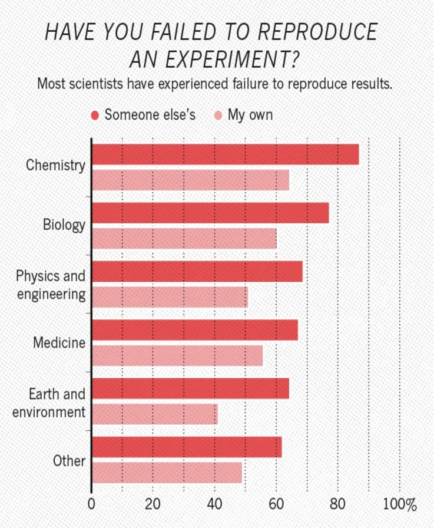
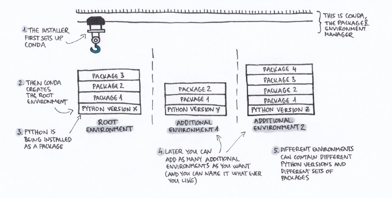
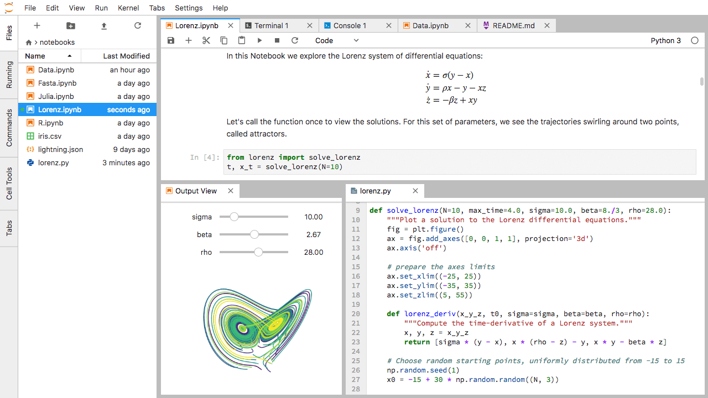

% Tools for Reproducible Research
% Alex Coleman <br> Research Computing
% 10th December 2020

# Get the slides 
<h2>
[https://bit.ly/RC-LIDA20](https://bit.ly/RC-LIDA20)
</h2>

# Got a question?

Please pop questions in the chat as you think of them. I'll either take them at the end or if I find a good moment to respond.

Who are Research Computing?
----------------------------

The Research Computing Team are a collection of research software engineers and data analysts spread across LIDA and IT including:

- Mark Conmy
- Martin Callaghan
- John Hodrien
- Ollie Clark
- Adam Keeley
- Sean Tuck
- Phil Chambers
- Nick Rhodes
- Alex Coleman
- Samantha Crossfield

# Motivations 


<figcaption>
    PhD Comics ID 1689
</figcaption>


What's all the fuss about?
---------------------------

<div style="display:flex; align-items:center; justify-content: center;">



</div>
<figcaption>
Images from [Nature](https://www.nature.com/news/1-500-scientists-lift-the-lid-on-reproducibility-1.19970)
</figcaption>

# Agenda

<p style="text-align:left;">
Today we're going to touch on ways to make our code reproducible.
</p>

- __Basics__ \- version control and project management
- __Conda__ \- to record environments and manage packages
- __Virtual Machines__ \- using vagrant to script virtual machine configuration
- __Containers__ \- a small, portable approach to sharing environments
- __Workflow tools__ \- e.g. Snakemake, Luigi
- __Notebooks__ \- The computational scientists lab book

# Basic building blocks

<p style="text-align:left;">
The basic building blocks of a good, reproducible project are:
</p>

- version control e.g. git
- Simple project management structure

## Version control

<p style="text-align:left;">
Version control or source control systems are means by which we can track changes in our code. 
</p>

- It keeps a clear and accountable linear timeline of changes
- Very useful when coding in a team
- Prevents folders filling up with <br> `draft1.txt draft1.2.txt draft.1.2.3.txt`
- We encourage people to use [`git`](https://swcarpentry.github.io/git-novice/)


## Project management

<p style="text-align:left;">
Keeping all files relating to a project in a single folder is a good starting point.
</p>

```
project_name/
├── README.md             # overview of the project
├── data/                 # data files used in the project
│   ├── README.md         # describes where data came from
│   └── sub-folder/       # may contain subdirectories
├── processed_data/       # intermediate files from the analysis
├── manuscript/           # manuscript describing the results
├── results/              # results of the analysis (data, tables, figures)
├── src/                  # contains all code in the project
│   ├── LICENSE           # license for your code
│   ├── requirements.txt  # software requirements and dependencies
│   └── ...
└── doc/                  # documentation for your project
    ├── index.rst
    └── ...
```

<figcaption>
[Cookie cutter](https://cookiecutter.readthedocs.io/en/1.7.2/) and [RStudio projects](https://swcarpentry.github.io/r-novice-gapminder/02-project-intro/) are a good entry point for this.
</figcaption>

# Conda

<p style="text-align:left;">
The code we write often depends on other code. Tools such as conda try to help isolate 
specific dependencies:
</p>

- Install packages with specific versions
- Record those versions
- Isolate environments with distinct packages
- Using different R/Python versions per project
- Provides tools for sharing environments and packages

## Conda illustrated



<figcaption>
Graphic from [Geohackweek Conda Tutorial](https://geohackweek.github.io/datasharing/01-conda-tutorial/)
</figcaption>

# Virtual machines and Vagrant

- Virtual machines allow us to run an alternate operating system on our host machine.
- They require some set up, but can be super useful
- Vagrant is a tool that can help!

## Vagrantfile

- We write a Vagrant recipe file that allows anyone to replicate the exact operating system environment used to run your code

```

                        Vagrant.configure("2") do |config|
                            config.vm.box = "hashicorp/bionic64"
                        end


```

- We did a TechTalk earlier this year that showcases [Vagrant with examples](https://arc.leeds.ac.uk/Techtalks/techtalk-vagrant/#/title-slide)

# Containers

<div style="display:flex; align-items:center; justify-content: center;">


</div>
<figcaption>
Docker and Singularity Logos
</figcaption>

## 


## What are containers?

- Containers let you bundle up __all__ the ingredients into a single package that you can run
- This means you don't need a virtual machine and makes them very portable
- They have drawbacks but can be a powerful tool for sharing code/results

# Workflow tools

## Capturing our workflow takes many forms

## Just remembering where we clicked


## Use Bash or GNU Make


## Use workflow tools like Snakemake/Luigi


## Snakemake and Luigi are workflow managers


<figcaption>
Taken from [Snakemake Documentation](https://snakemake.readthedocs.io/en/stable/#)
</figcaption>

## Snakemake concepts

- Snakemake is easy to learn
- Available on all platforms and HPC compatible🎉
- Workflows can scale from laptop to cluster

# Notebooks

## 

<div style="display:flex; align-items:center; justify-content: center;">


</div>
<figcaption>
Jupyter and Rmarkdown logos
</figcaption>

## Jupyter



## Jupyter

- JupyterLab is an interactive development environment
- It lets you code, write notes, include graphics
- You can run it in Python, R, Julia and many [others](https://github.com/jupyter/jupyter/wiki/Jupyter-kernels)

## Reproducify your notebooks


## 

- [BinderHub](https://mybinder.org/), is a service that lets you run your notebooks on the web
- [Google colab](https://colab.research.google.com/notebooks/intro.ipynb), a google service that provides a notebook like environment for writing code and easy access to GPUs
- [Jupyter Book](https://jupyterbook.org/intro.html), a package that can turn your notebooks into pdfs or interactive books

# Thank you


## Keep in touch

<p style="text-align: left;">
Thanks for listening and I hope you've found this talk interesting!

Research Computing is here to help with all this so get in touch via
</p>

- Send us a question: [https://bit.ly/arc-help](https://bit.ly/arc-help)
- Email: [ask-rc@leeds.ac.uk](mailto:ask-rc@leeds.ac.uk)
- Reach out to us via Teams
- Link to the [GitHub repo](https://github.com/ARCLeeds/Techtalks/tree/master/techtalk-LIDASem) for these slides

# A potted further reading list

## Talks

- Gabriel Becker's [An Imperfect Guide to Imperfect Reproducibility](https://gmbecker.github.io/MayInstituteKeynote2019/outline.html)
- Tania Allard's slide deck on [Jupyter notebooks: Friends or Foes?](https://speakerdeck.com/trallard/jupyter-notebooks-friends-or-foes)
- Making your code citable from [GitHub](https://guides.github.com/activities/citable-code/)

## Projects

- [The Turing Way](https://the-turing-way.netlify.app/welcome)
- [Coderefinery](https://coderefinery.org/)
- [The Carpentries project](https://carpentries.org/)
- [UK Reproducibility Network](https://www.ukrn.org/)
- [ReproducibiliTea Leeds](https://osf.io/qvyk4/)
- [University of Leeds Library Open research guide](https://library.leeds.ac.uk/info/1406/researcher_support/199/open_research)